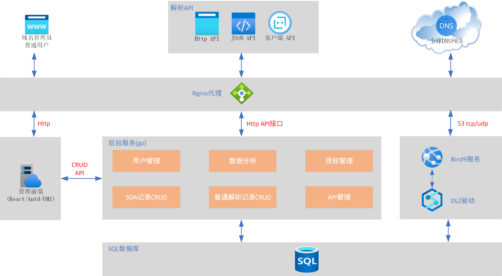
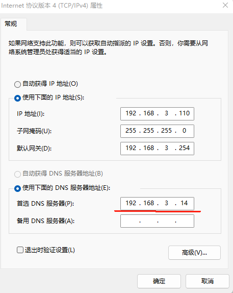
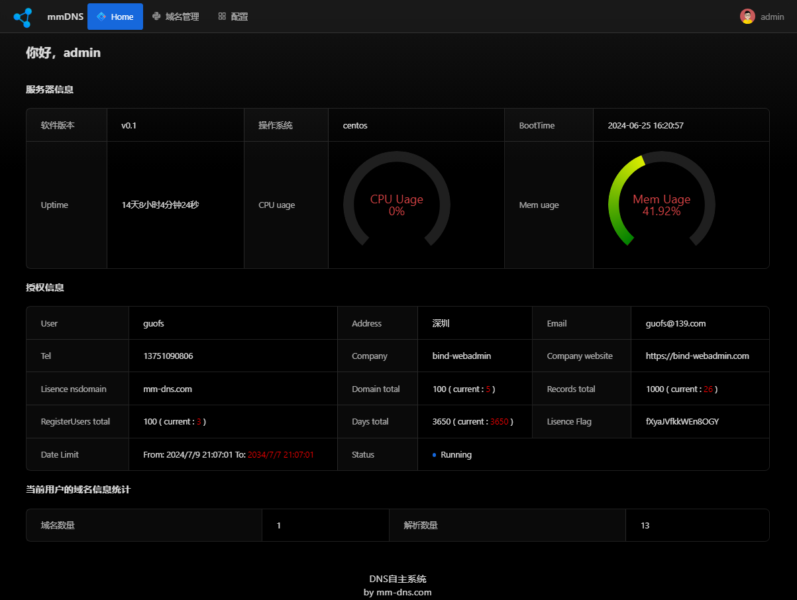

# about bind webadmin project
DNS is one of the cornerstones of Internet communication. The reliability, flexibility, and security of DNS (Domain Name System) are indispensable key factors for enterprise success.

Bind-webadmin is based on bind9 and manages various types of records through web methods. The use of bind-webadmin can quickly deploy a professional DNS server, enabling each bind-webadmin user to have their own dynamic DNS platform without relying on third-party platforms.

website
https://bind-webadmin.com

demo
https://mm-dns.com

> 提示
> 此部分开源的为bind-webadmin project的前端代码，欢迎大家讨论和指导。

# 架构图


<br />

# Core Objectives of the Project
- **webadmin** assists users in rapidly setting up a comprehensive dynamic DNS system. It is self-hosted, eliminating the need for third-party dynamic DNS services, thus giving users full control.
- A professional-grade DNS system can be maintained by regular IT operation and maintenance personnel, reducing enterprise DNS operation and maintenance costs.

# Brief Description of Functions
1. **Web-based Management**: Manage domains and various records resolved by bind9 through a web interface.
2. **Flexible Domain Resolution**: Freely resolve both public and private domains.
3. **Customizable TTL Values**: Set TTL values for resolution records flexibly, with a minimum configuration of 1 second, meeting the needs of scenarios requiring high real-time performance.
4. **API Interface**: Provide an API for users to programmatically resolve various records.
5. **Client Program**: Automatically recognize changes in user IP (choosing either public exit IP or user's local IP) and initiate updates.
6. **Dynamic Domain Configuration**: Users can configure their domains as dynamic domains for real-time resolution.
7. **IPv6 Record Support**: Support for writing IPv6 records.
8. **Reverse Resolution Record Addition**: Add reverse resolution records.

# Application Scenarios
- **Remote Work Environment**: For individuals who need to work from home and have internal servers, this tool ensures stable access to internal network resources even when the external IP changes.
- **Smart Home Integration**: Allows smart devices to be remotely controlled via a fixed domain name, unaffected by ISP-initiated IP changes.
- **Smart Integrated Applications**: Such as home routers, home NAS, smart cameras, smart sensors, smart streetlights, and smart billboards. Industries include IoT, connected vehicles, industrial IoT, smart education, smart government, and more.
- **Technical Education**: Students learning network fundamentals and automated operation and maintenance can use this project to understand the working principles of DNS and practical applications of script programming.

# deploy by docker
## install
```bash
# wget https://data.bind-webadmin.com/dw/bind-webadmin.v0.1.tar.gz
# tar zxvf bind-webadmin.v0.1.tar.gz
# cd bind-webadmin.v0.1
# sh install.sh  /bindwebadmin  # 格式: sh install.sh  /install_dir 
                                # 安装目录为 /install_dir
                                # 书写格式: 以 / 开头，且不能以 / 为结尾
                                # 例如：
                                #    /abc/123    正确
                                #    /abc/123/   错误
                                # 若不写明安装目录，则默认安装目录为 /app , 如下。
                                # sh install.sh

# tree /bindwebadmin            # 安装在 /bindwebadmin 目录。在安装前需保证本宿主中没有该目录。安装过程中会创建该目录。
/bindwebadmin
├── bind                        # bind9配置文件。容器第一次被创建时，会修改named.conf文件。
│   ├── named.ca
│   ├── named.conf              # bind9主配置文件。在容器启动后，若修改此文件，需重启容器。
│   ├── named.empty
│   ├── named.localhost
│   ├── named.loopback
│   ├── named.rfc1912.zones
│   ├── redirect.db
│   ├── rndc.conf
│   └── rndc.key
├── cert                        # 证书目录
│   ├── dhparams.pem
│   ├── fullchain.pem
│   └── privkey.pem
├── docker-compose.yml          # docker compose 配置文件.容器间调用采用的是容器名称，不要更改此文件中的容器名称。
├── env.txt                     # 主配置文件(环境变量)。供各个容器初始化时统一调用。仅第一次创建容器时生效。 
├── mysql/                      # mysql数据目录。当容器第一次创建时，该目录会被写入数据库初始化数据。
└── server                      # 后台配置。当容器第一创建时，系统自动修改app.conf。
    ├── app.conf                # 在容器启动后，若修改此文件，需重启容器。
    └── lisence.txt             # 授权配置文件  
```

config env.txt
```bash
# cd /bindwebadmin
# vi env.txt
# NS_DOMAIN值必须与bind_backend中的配置文件app.conf中的ns变量值相同。
# Note:
# - 此参数为核心配置
# - 此时 NS_DOMAIN 值不能配置为 test.io 和 example.com ,主要原因是这两个域名已被系统默认写入数据库，供 demo 用户测试使用。
# - 支持子域名配置，如 NS_DOMAIN='diy.hello.com', 但不建议使用。
NS_DOMAIN='hello.com'

# bind webadmin服务器IP,如下两种情况，二选一。
# 情况一：当配置为公共DNS服务时，将下面的NS_IP改为当前bind webadmin服务器的公网NAT映射IP
# 情况二: 仅配置为私有DNS时，将下面的NS_IP改为当前bind webadmin服务器的私有ip
# 此参数为核心配置
NS_IP=192.168.3.14
# 本例中，宿主ip为192.168.3.14

SSL=false
```
deploy
```bash
# docker compose up -d 
# docker ps
CONTAINER ID   IMAGE                                                     COMMAND                  CREATED         STATUS              PORTS                                              NAMES
ff5dfdeb80c8   registry.cn-hangzhou.aliyuncs.com/darry/bind_proxy:v1     "/entrypoint.sh"         2 minutes ago   Up About a minute   0.0.0.0:80->80/tcp, 22/tcp, 0.0.0.0:443->443/tcp   app-bind_proxy-1
c243de969590   registry.cn-hangzhou.aliyuncs.com/darry/bind_front:v1     "/docker-entrypoint.…"   2 minutes ago   Up About a minute   80/tcp, 0.0.0.0:9091->9091/tcp                     app-bind_front-1
8cc768945d27   registry.cn-hangzhou.aliyuncs.com/darry/bind:v1           "docker-entrypoint.sh"   2 minutes ago   Up 59 seconds       0.0.0.0:53->53/tcp, 0.0.0.0:53->53/udp, 953/tcp    app-bind9-1
c5754055d43d   registry.cn-hangzhou.aliyuncs.com/darry/bind_backend:v1   "/entrypoint.sh"         2 minutes ago   Up About a minute   0.0.0.0:9090->9090/tcp                             app-bind_backend-1
952156a17811   registry.cn-hangzhou.aliyuncs.com/darry/bind_mysql:v1     "docker-entrypoint.s…"   2 minutes ago   Up 2 minutes        0.0.0.0:3306->3306/tcp, 33060/tcp                  app-bind_mysql-1 
```

## test
使用nslookup测试
```bash
C:\Users\Administrator>nslookup
Address:  192.168.3.1

> server 192.168.3.14        # bind webadmin服务器的ip
默认服务器:  [192.168.3.14]
Address:  192.168.3.14

> baidu.com
服务器:  [192.168.3.14]
Address:  192.168.3.14

非权威应答:
名称:    baidu.com
Addresses:  39.156.66.10
          110.242.68.66

> dns.hello.com
服务器:  [192.168.3.14]
Address:  192.168.3.14

名称:    dns.hello.com
Address:  192.168.3.14

> hello.com
服务器:  [192.168.3.14]
Address:  192.168.3.14

名称:    hello.com
Address:  192.168.3.14

> api.hello.com
服务器:  [192.168.3.14]
Address:  192.168.3.14

名称:    api.hello.com
Address:  192.168.3.14

>
```
将你自己当前电脑的DNS修改为bind webadmin服务IP，如本例的`192.168.3.14`

<br />

在chrome中打开 http://hello.com 或 http://dsn.hello.com 或 http://www.hello.com 
默认帐号
- admin/admin1111mm
- demo/demo1111mm


<br />

